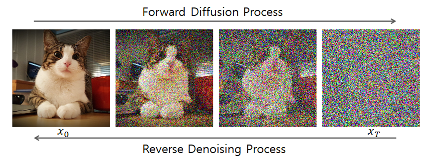
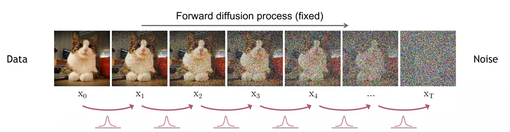
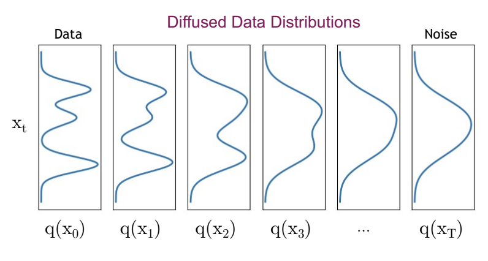
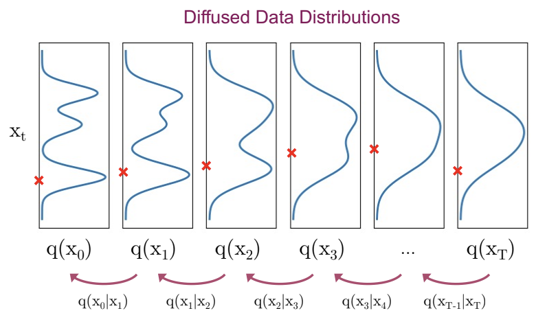
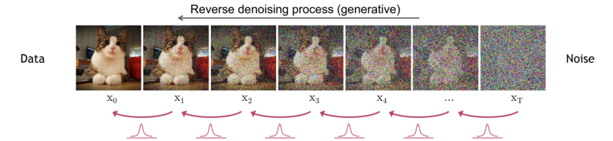
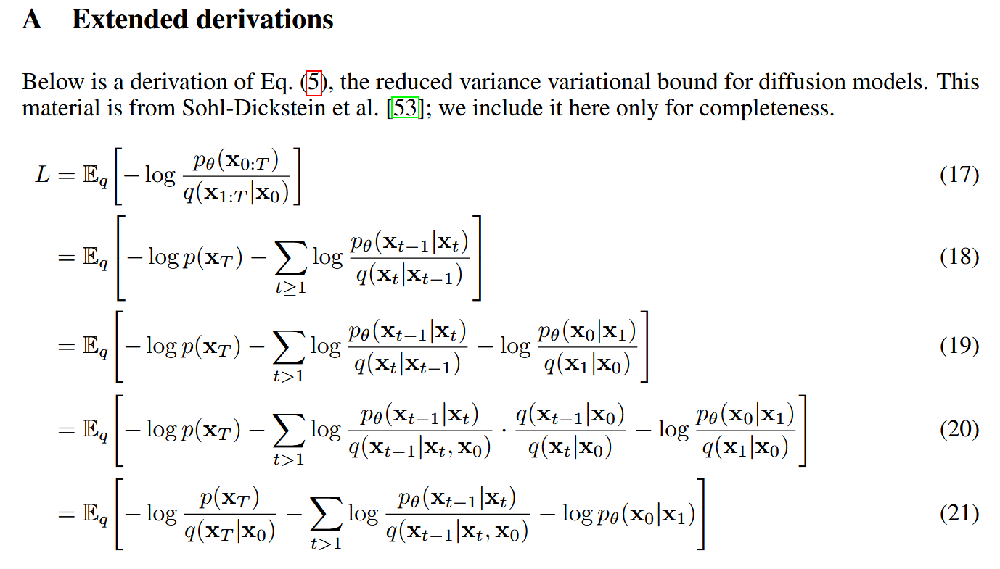
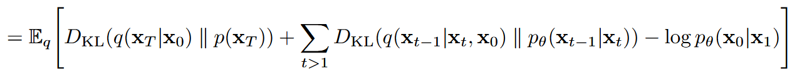
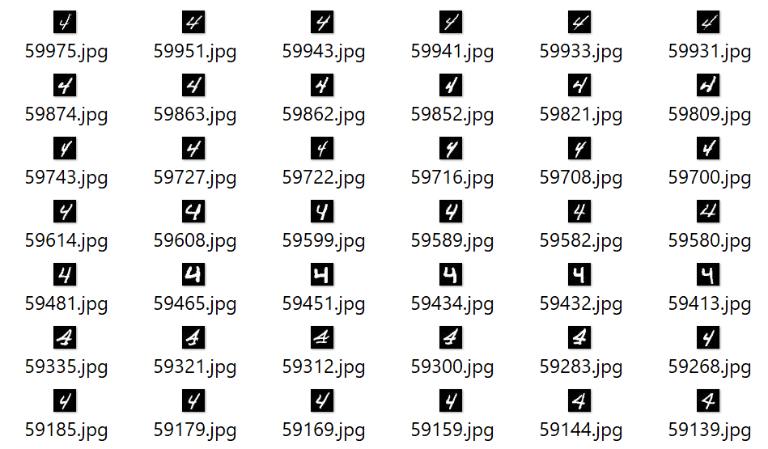
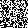
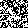

# Diffusion Model-Based Sign Language Generation

> IDEA Lab | 강민혁

---

# Contents

1. Denoising Diffusion Probabilistic Models (DDPM)
2. DDPM with conditional model
3. Human Motion Diffusion Model (HMD)
4. SignDiff: Diffusion Model for American Sign Language Production
5. Introduction to the Research Topic

---

# DDPM: Denoising Diffusion Probabilistic Models

## 1. Why DDPM is Important

### Revolutionary Impact on Generative Modeling
- **Paradigm Shift**: DDPM introduced a fundamentally different approach to generative modeling, moving away from adversarial training (GANs) and autoregressive models
- **State-of-the-Art Results**: Achieved unprecedented quality in image synthesis (FID 3.17 on CIFAR-10, surpassing GANs)
- **Stable Training**: Unlike GANs, DDPM provides stable training without mode collapse or adversarial instability
- **Theoretical Foundation**: Grounded in non-equilibrium thermodynamics and stochastic differential equations

### Key Advantages
1. **High-Quality Generation**: Produces remarkably realistic images
2. **Training Stability**: No adversarial training, more stable convergence
3. **Theoretical Rigor**: Strong mathematical foundations
4. **Controllability**: Natural progressive generation process
5. **Flexibility**: Can be applied to various data types (images, audio, text)

---

## 1. Why DDPM is important


<!-- 물리적 내용 포함

왜 "확산"모델이라고 하는지

충분히 우려진 차에서 물과 차를 분리하는 것은 어려움.

차 입자가 어디로 어떻게 움직였는지 안다면?

차 입자는 가우시안 분포 내에서 다음 위치로 움직임.

"작은 sequence에서의 확산은 forward와 reverse 모두에서 가우시안 분포 내에서 이루어진다."

실제로 비평형 열역학(non-equilibrium thermodynamics)에서 이가 증명이 됨.

작은 sequence(또는 작은 입자 수)에서의 flux(확산)이 가우시안 분포내에서 이루어짐. -->

> Diffusion models simulate how particles (like tea in water) spread out, based on physical diffusion principles.

- Difficult to know the distribution of particles n seconds after adding tea leaves

- But, after a long time, particles will be evenly distributed

- it based on *non-equilibrium thermodynamics*,
    - where particle movement follows Gaussian distributions in both forward and reverse processes.

- If we could track each particle’s movement, we could theoretically reverse the process, which is what DDPMs attempt mathematically.

---

## 2. Mathematical Foundations



- $q()$ is forward process; adding noise
- $p_\theta()$ is reverse process; de-noise

---

### 2.1 Forward Process (Diffusion Process)



> The forward process gradually adds Gaussian noise to data over T timesteps:

$$
q(x_t | x_{t-1}) = \mathcal{N}(x_t; \sqrt{1-\beta_t}x_{t-1}, \beta_t I)
$$

Where:
- $x_0$ is the original data
- $\beta_t$ is the noise schedule at time $t$
- $T$ is the total number of timesteps

<br/><br/>



The complete forward process: <!--joint distribution-->
$$
q(x_{1:T} | x_0) = \prod_{t=1}^{T} q(x_t | x_{t-1})
$$

---

### 2.2 Reparameterization Trick

Using $\alpha_t = 1 - \beta_t$ and $\bar{\alpha}_t = \prod_{s=1}^{t} \alpha_s$:
<!-- α_t << Forward Process의 timestep에서 x_t-1의 정보를 얼마나 보존할지를 결정하는 값 -->
<!-- a_bar_t << 누적 곱(Cumulative Product) 결과 // 최초 원본 데이터x_0의 정보가 t단계까지 진행되었을 때 총 얼마나 남아있는지 -->
$$ 
q(x_t | x_0) = \mathcal{N}(x_t; \sqrt{\bar{\alpha}_t}x_0, (1-\bar{\alpha}_t)I)
$$

This allows direct sampling at any timestep:
$$
x_t = \sqrt{\bar{\alpha}_t}x_0 + \sqrt{1-\bar{\alpha}_t}\epsilon, \quad \epsilon \sim \mathcal{N}(0,I)
$$

---

### 2.3 Reverse Process (Denoising Process)

#### how can we de-noise



we want $x_T$(pure-noise) to $x_0$(original img)

<!-- assumtion that noise follow gaussian dist -->

---
### 2.3 Reverse Process (Denoising Process)



<!-- based on gausian dist라는 intuition을.. -->

The reverse process learns to denoise:
$$
p_\theta(x_{t-1} | x_t) = \mathcal{N}(x_{t-1}; \mu_\theta(x_t, t), \Sigma_\theta(x_t, t)) 
$$

<!-- mu << 예측한 노이즈를 바탕으로 계산되는 값 -->
<!-- sigma << diffusion process에서 미리 정해둔 hyperparameter -->

<!-- 예측한 평균과 분산은 추후..? 설명하도록

뒤에 loss 유도 부분에서 -->

Complete reverse process:
$$
p_\theta(x_{0:T}) = p(x_T) \prod_{t=1}^{T} p_\theta(x_{t-1} | x_t)
$$

> We want to know **mean** and **variance** of Gaussian distribution

---

### 2.4 Variational Lower Bound Derivation

#### We want to..

<!-- 원본 데이터인 x_0가 나타날 (log) likelihood 최대화 -->
$$
\underset{\theta}{\operatorname{arg\,max}} \log p_{\theta}(x_0)
$$

We need to integral every latent variables ($x_{1:T}$) <!-- 중간에 있는 gausian dist들 -->
$$
\log p_{\theta}(x_0) = \log \int p_{\theta}(x_{0:T}) dx_{1:T}
$$

But.. this integral must be consider any combinations of latent variables

-> Derive ELBO using Jensen's Inequality

---

<!-- 로그가 적분 바깥에 있지 않으니 jensen's inequality 불가 -->
$$
log(p(x_0)) = \int p(x_{0:T})dx_{1:T}
$$

$$
\log p(x_0) = \log \left( \int \frac{p(x_{0:T})}{q(x_{1:T} \mid x_0)} q(x_{1:T} \mid x_0) \, dx_{1:T} \right)
$$

<!-- based on 확률분포에 대한 적분 공식 -->
<!-- == 확률 분포에 대한 기댓값 -->
<!-- 확률밀도함수에 어떤 함수 f(x)를 곱해서 적분하면, 그 결과는 f(x)의 기댓값 -->

$$
\log p(x_0) = \log \left( \mathbb{E}_{q(x_{1:T} \mid x_0)} \left[ \frac{p(x_{0:T})}{q(x_{1:T} \mid x_0)} \right] \right)
$$

<samll>

$$
f(\mathbb{E}[X]) \geq \mathbb{E}[f(X)]
$$

</small>


<!-- 오른쪽 항 최대화 -> 실제 데이터 분포-->
<!-- 하지만 lossfunc로 사용하는 거니 - 붙여서 최소화 -->

$$
\log \left( \mathbb{E}_q\left[ \frac{p(x_{0:T})}{q(x_{1:T} \mid x_0)} \right] \right) \geq \mathbb{E}_q \left[ \log \frac{p(x_{0:T})}{q(x_{1:T} \mid x_0)} \right]
$$

---

### 2.4 Variational Lower Bound Derivation




minimizes the divergence between $q(x_{t-1})$ and $p_\theta(x_{t-1})$

> We got **MSE**!

<!-- latent variables가 있는 걸 -->
<!-- 베이지안 & markov chain rule 을 사용해서 직접 구할 수 있는 수식으로 변환 -->
<!-- diffusion process에서와 reverse process에서 모두 가우시안이라고 가정 -> 둘 사이의 kl divergence를 구할 수 있음 -->
<iframe width="560" height="315" src="https://www.youtube.com/embed/ybvJbvllgJk?si=p65ozY-oOW4T9K2Z" title="YouTube video player" frameborder="0" allow="accelerometer; autoplay; clipboard-write; encrypted-media; gyroscope; picture-in-picture; web-share" referrerpolicy="strict-origin-when-cross-origin" allowfullscreen></iframe>

---

### 적당한소제목

$$
L_{t-1} = D_{\mathrm{KL}}\left(q(x_{t-1} \mid x_t, x_0) \,\|\, p_\theta(x_{t-1} \mid x_t)\right)
$$
<!-- 가우시안분포일때의 kl divergence 공식을 통해 나타내면.. -->
<!-- 앞 페이지 적당히 넘어가서 terms 가져오기-->
$$
= \mathbb{E}_q \left[ \frac{2\sigma_t^2}{1} \left\| \tilde{\mu}_t(x_t, x_0) - \mu_\theta(x_t, t) \right\|^2 \right] + C
$$
<br/><br/>

<!-- e(x_t, t) noise 데이터에서 모델이 예측한 노이즈 -->
$$
\mu_\theta(\mathbf{x}_t, t) = \frac{1}{\sqrt{1 - \beta_t}} \left( \mathbf{x}_t - \frac{\beta_t}{\sqrt{1 - \bar{\alpha}_t}} \, \epsilon_\theta(\mathbf{x}_t, t) \right)
$$


$$
L_{t-1} = \mathbb{E}_{\mathbf{x}_0 \sim q(\mathbf{x}_0), \epsilon \sim \mathcal{N}(\mathbf{0}, \mathbf{I})} \left[ \frac{\beta_t^2}{2\sigma_t^2(1-\beta_t)(1-\bar{\alpha}_t)} \left\| \epsilon - \epsilon_\theta(\underbrace{\sqrt{\bar{\alpha}_t}\mathbf{x}_0 + \sqrt{1-\bar{\alpha}_t}\epsilon}_{\mathbf{x}_t}, t) \right\|^2 \right] + C

$$

-> **only the noise prediction** gives the final loss


---

### implementation


1. SimpleDDPM.init()

- initialize noise scheduling

```python
def __init__(self, image_size=28, channels=3, timesteps=1000,
             beta_start=1e-4, beta_end=0.02):
    
    # beta linear schedule
    betas = torch.linspace(beta_start, beta_end, timesteps)
    
    alphas = 1 - betas
    
    # \bar{\alpha}_t = PI(α_i) from i=1 to t
    alpha_cumprod = torch.cumprod(alphas, dim=0)
    
    # \bar{\alpha}_{t-1} (t-1일 때의 cumulative product)
    alpha_prev = torch.cat([torch.tensor([1.]), alpha_cumprod[:-1]], dim=0)
```

2. q_sample()

- Forward Diffusion Process

- generate noise image from random timestep t
    - x_0 -> x_t

```python
def q_sample(self, x_start, t):
    # \sqrt{\bar{\alpha}_t}
    sa = self.sqrt_alpha_cumprod[t].view(-1,1,1,1)
    
    # \sqrt{1-\bar{\alpha}_t}
    sb = self.sqrt_one_minus_alpha[t].view(-1,1,1,1)
    
    # x_t = \sqrt{\bar{\alpha}_t} \cdot x_0 + \sqrt{1-\bar{\alpha}_t} \cdot \varepsilon
    return sa * x_start + sb * noise
```

3. p_losses()

- calculate loss func

```python
def p_losses(self, x_start, t):
    noise = torch.randn_like(x_start)
    
    # add noise at the forward process
    x_noisy = self.q_sample(x_start, t, noise)
    
    # model predict noise 
    pred_noise = self.model(x_noisy, t)
    
    # return the MSE loss results that diffrential between real noise and prediction noise
    return nn.functional.mse_loss(pred_noise, noise)
```

4. p_sample()

- reverse diffusion process

- calculate mean of previouse timestep using predicted noise


```python
def p_sample(self, x, t):
    beta_t = self.betas[t].view(-1,1,1,1)
    sa_cum = self.sqrt_one_minus_alpha[t].view(-1,1,1,1)  # sqrt{1-\bar{\alpha}_t}

    sr = (1.0 / torch.sqrt(self.alphas[t])).view(-1,1,1,1)  # frac{1}{\sqrt{\alpha_t}}
    
    # predict noise
    eps = self.model(x, t)
    
    # calc mean mu_0(x_t, t)
    mean = sr * (x - beta_t * eps / sa_cum)
    
    if t[0] == 0:
        return mean
    
    # calc variance sigma_t^2
    var = beta_t * (1 - self.alpha_prev[t]) / (1 - self.alpha_cumprod[t])
    
    # x_{t-1} = mu_θ(x_t, t) + sigma_t * z, z ~ N(0,I)
    return mean + torch.sqrt(var).view(-1,1,1,1) * torch.randn_like(x)
```

5. sample()

- de-noising each step

- call `p_sample()` each step for probabilistic sampling

```python
def sample(self, batch_size=1):
    shape = (batch_size, 1, 28, 28)
    
    # x_T ~ N(0,I)
    img = torch.randn(shape, device=device)
    
    # T → T-1 → ... → 1 → 0 sequential denoising
    for i in reversed(range(self.betas.size(0))):
        t = torch.full((batch_size,), i, dtype=torch.long, device=device)
        img = self.p_sample(img, t)
    
    return img
```

---

### results

- dataset
    - mnist dataset
    - use num `4` (judge to be moderately complex)
    - number of data used: 5843




<div style="display: flex; gap: 10px;">
  
  
</div>

left: epoch10, loss 0.92
right: epoch300, loss 0.51

loss converged around 0.5


---


<!-- 

### 2.4 Variational Lower Bound Derivation

The training objective maximizes the log-likelihood:
$$
\log p_\theta(x_0) = \log \int p_\theta(x_{0:T}) dx_{1:T}
$$

Using Jensen's inequality:
$$
\log p_\theta(x_0) \geq \mathbb{E}_{q(x_{1:T}|x_0)}[\log \frac{p_\theta(x_{0:T})}{q(x_{1:T}|x_0)}] = -L_{VLB}
$$

The variational lower bound decomposes as:
$$
L_{VLB} = L_T + L_{T-1} + \cdots + L_1 + L_0
$$

Where:
- $L_T = D_{KL}(q(x_T|x_0) \| p(x_T))$
- $L_{t-1} = D_{KL}(q(x_{t-1}|x_t, x_0) \| p_\theta(x_{t-1}|x_t))$ for $t = 2, \ldots, T$
- $L_0 = -\log p_\theta(x_0|x_1)$

---

## 3. Loss Function Formulation

### 3.1 Simplified Loss Function

The key insight is that we can parameterize the mean as:
$$
\mu_\theta(x_t, t) = \frac{1}{\sqrt{\alpha_t}}\left(x_t - \frac{\beta_t}{\sqrt{1-\bar{\alpha}_t}}\epsilon_\theta(x_t, t)\right)
$$

This leads to the simplified loss:
$$
L_{simple} = \mathbb{E}_{t, x_0, \epsilon}[\|\epsilon - \epsilon_\theta(x_t, t)\|^2]
$$

Where:
- $\epsilon \sim \mathcal{N}(0, I)$ is the noise added at timestep $t$
- $\epsilon_\theta(x_t, t)$ is the predicted noise by the neural network
- $x_t = \sqrt{\bar{\alpha}_t}x_0 + \sqrt{1-\bar{\alpha}_t}\epsilon$

### 3.2 Weighted Loss Function

The authors propose a weighted version:
$$
L_{weighted} = \mathbb{E}_{t, x_0, \epsilon}[w_t \|\epsilon - \epsilon_\theta(x_t, t)\|^2]
$$

Where the optimal weight is:
$$
w_t = \frac{\beta_t^2}{2\sigma_t^2 \alpha_t (1-\bar{\alpha}_t)}
$$

### 3.3 Connection to Score Matching

The loss function is equivalent to denoising score matching:
$$
L_{score} = \mathbb{E}_{t, x_0, \epsilon}[\|\nabla_{x_t} \log q(x_t | x_0) - s_\theta(x_t, t)\|^2]
$$

Where $s_\theta(x_t, t) = -\frac{\epsilon_\theta(x_t, t)}{\sqrt{1-\bar{\alpha}_t}}$ is the score function.

---

## 4. Implementation Details

### 4.1 Network Architecture

**U-Net with Attention**:
- **Encoder**: Downsampling blocks with ResNet layers
- **Decoder**: Upsampling blocks with skip connections
- **Attention**: Multi-head attention at multiple resolutions
- **Time Embedding**: Sinusoidal positional encoding for timestep $t$

```python
class UNet(nn.Module):
    def __init__(self, in_channels=3, out_channels=3, time_dim=256):
        super().__init__()
        self.time_mlp = nn.Sequential(
            SinusoidalPosEmb(time_dim),
            nn.Linear(time_dim, time_dim * 4),
            nn.GELU(),
            nn.Linear(time_dim * 4, time_dim)
        )
        # ... U-Net architecture
```

### 4.2 Training Algorithm

```python
def train_step(model, x_0, t, noise_scheduler):
    # Sample noise
    noise = torch.randn_like(x_0)
    
    # Forward process
    x_t = noise_scheduler.add_noise(x_0, noise, t)
    
    # Predict noise
    predicted_noise = model(x_t, t)
    
    # Compute loss
    loss = F.mse_loss(predicted_noise, noise)
    
    return loss
```

### 4.3 Sampling Algorithm

```python
def sample(model, shape, num_steps, noise_scheduler):
    x = torch.randn(shape)
    
    for i in reversed(range(num_steps)):
        t = torch.full((shape[0],), i, dtype=torch.long)
        
        # Predict noise
        predicted_noise = model(x, t)
        
        # Denoise step
        x = noise_scheduler.step(predicted_noise, t, x)
    
    return x
```

---

## 5. Noise Schedules

### 5.1 Linear Schedule
$$
\beta_t = \beta_1 + \frac{t-1}{T-1}(\beta_T - \beta_1)
$$

### 5.2 Cosine Schedule
$$
\bar{\alpha}_t = \frac{f(t)}{f(0)}, \quad f(t) = \cos\left(\frac{t/T + s}{1 + s} \cdot \frac{\pi}{2}\right)^2
$$

### 5.3 Improved Schedules
Recent work shows that carefully designed schedules can significantly improve performance:
- **Cosine schedule**: Better for small datasets
- **Learned schedules**: Optimized during training
- **Adaptive schedules**: Adjust based on model confidence

---

## 6. Datasets and Experimental Results

### 6.1 Primary Datasets

**CIFAR-10**:
- 32×32 RGB images
- 10 classes, 50,000 training images
- **Results**: FID 3.17, IS 9.46

**LSUN**:
- High-resolution images (256×256)
- Multiple categories (bedrooms, churches, towers)
- **Results**: Sample quality comparable to ProgressiveGAN

**CelebA-HQ**:
- 256×256 celebrity faces
- 30,000 high-quality images
- **Results**: State-of-the-art face generation

### 6.2 Evaluation Metrics

**Frechet Inception Distance (FID)**:
$$
FID = \|\mu_r - \mu_g\|^2 + \text{Tr}(\Sigma_r + \Sigma_g - 2(\Sigma_r \Sigma_g)^{1/2})
$$

**Inception Score (IS)**:
$$
IS = \exp(\mathbb{E}_{x \sim p_g} D_{KL}(p(y|x) \| p(y)))
$$

---

## 7. Text-to-Image Generation

### 7.1 Conditioning Mechanism

To enable text-to-image generation, DDPM can be extended with conditioning:

$$
p_\theta(x_{t-1} | x_t, c) = \mathcal{N}(x_{t-1}; \mu_\theta(x_t, t, c), \Sigma_\theta(x_t, t, c))
$$

Where $c$ is the text condition.

### 7.2 Classifier Guidance

**Classifier-Guided Sampling**:
$$
\epsilon_\theta(x_t, t, c) = \epsilon_\theta(x_t, t) + s \cdot \nabla_{x_t} \log p_\phi(c | x_t)
$$

Where:
- $s$ is the guidance scale
- $p_\phi(c | x_t)$ is a classifier trained on noisy images

### 7.3 Classifier-Free Guidance

**Unconditional + Conditional Training**:
$$
\tilde{\epsilon}_\theta(x_t, t, c) = \epsilon_\theta(x_t, t) + s \cdot (\epsilon_\theta(x_t, t, c) - \epsilon_\theta(x_t, t))
$$

This approach trains a single model for both conditional and unconditional generation.

### 7.4 Text Encoding

**CLIP Text Encoder**:
- Transformer-based text encoder
- Maps text to embedding space
- Cross-attention in U-Net layers

```python
class TextConditionedUNet(nn.Module):
    def __init__(self, text_dim=512):
        super().__init__()
        self.text_encoder = CLIPTextEncoder()
        self.cross_attention = CrossAttention(text_dim)
        
    def forward(self, x, t, text):
        text_emb = self.text_encoder(text)
        x = self.cross_attention(x, text_emb)
        return self.unet(x, t)
```

---

## 8. Advanced Topics

### 8.1 Latent Diffusion Models

**Latent Space Diffusion**:
- Apply diffusion in latent space instead of pixel space
- Use VAE encoder/decoder
- Significantly reduces computational cost

$$
z_t = \sqrt{\bar{\alpha}_t}z_0 + \sqrt{1-\bar{\alpha}_t}\epsilon
$$

### 8.2 Improved Sampling

**DDIM (Denoising Diffusion Implicit Models)**:
- Deterministic sampling process
- Faster generation (10-50 steps vs 1000)
- Non-Markovian process

**DPM-Solver**:
- Numerical ODE solver for diffusion
- Even faster sampling
- Maintains high quality

### 8.3 Applications Beyond Images

**Audio Generation**:
- WaveGrad: Audio waveform generation
- Diffusion models for speech synthesis

**3D Generation**:
- Point cloud generation
- 3D shape synthesis

**Video Generation**:
- Temporal consistency
- Video diffusion models

---

## 9. Theoretical Connections

### 9.1 Stochastic Differential Equations

The continuous-time limit of DDPM is an SDE:
$$
dx = f(x, t)dt + g(t)dw
$$

Where $f(x, t)$ is the drift and $g(t)$ is the diffusion coefficient.

### 9.2 Score-Based Generative Models

Connection to score-based models:
$$
\nabla_{x_t} \log q(x_t) = -\frac{\epsilon_\theta(x_t, t)}{\sqrt{1-\bar{\alpha}_t}}
$$

### 9.3 Optimal Transport

Recent work connects diffusion models to optimal transport theory, providing new insights into the generation process.

---

## 10. Limitations and Future Directions

### 10.1 Current Limitations

1. **Slow Sampling**: Requires many denoising steps
2. **Computational Cost**: High memory and compute requirements
3. **Limited Control**: Difficulty in fine-grained control
4. **Mode Coverage**: Potential mode collapse in some cases

### 10.2 Future Directions

1. **Faster Sampling**: Improved numerical solvers
2. **Better Conditioning**: More sophisticated control mechanisms
3. **Multimodal Generation**: Text, audio, video integration
4. **Theoretical Understanding**: Better mathematical foundations

---
## 11. Conclusion

DDPM represents a fundamental breakthrough in generative modeling:

- **Theoretical Rigor**: Strong mathematical foundations
- **Practical Success**: State-of-the-art results across domains
- **Broad Impact**: Influenced numerous follow-up works
- **Future Potential**: Continues to drive innovation in AI

The combination of non-equilibrium thermodynamics, score matching, and deep learning has created a powerful framework for generation that continues to evolve and improve.


-->
