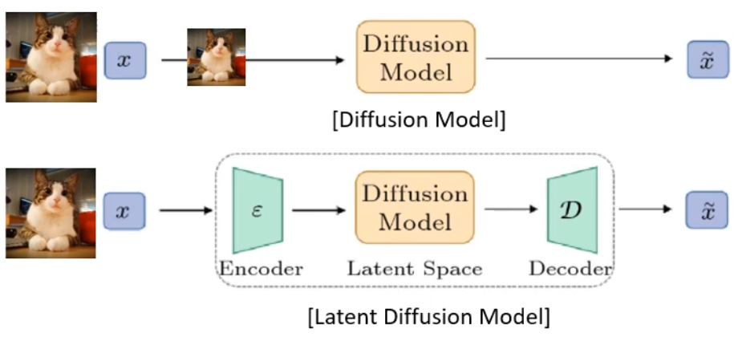
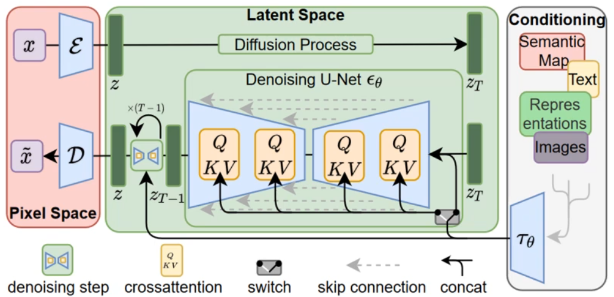
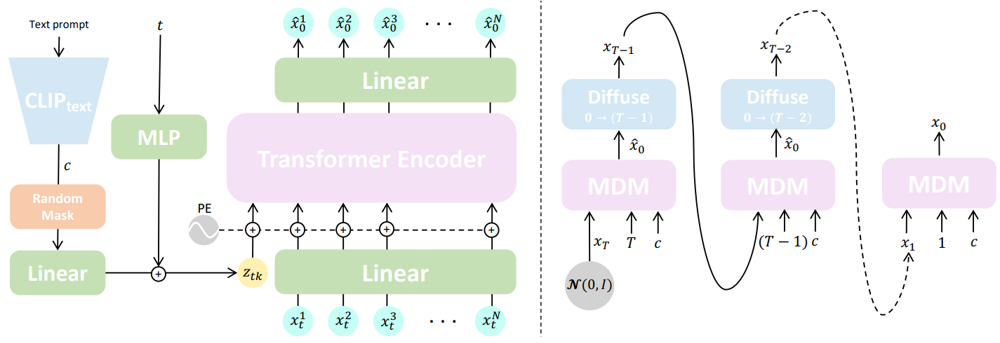
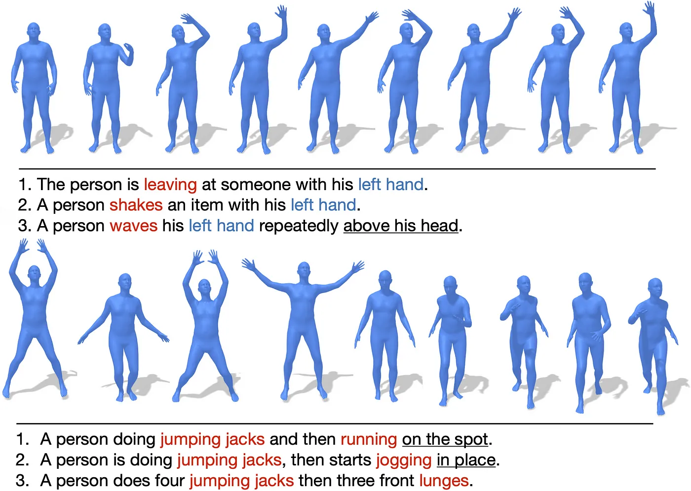
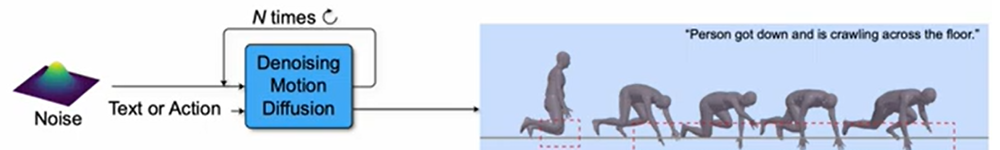

# Diffusion Model-Based Sign Language Generation

### DDPM to SignDiff

> IDEA Lab | 강민혁  
> 2025.07.23

---

# Contents

1. Denoising Diffusion Probabilistic Models (DDPM) <!-- 얘는 논문리뷰 느낌 -->
2. High-Resolution Image Synthesis with Latent Diffusion Models (LDM) <!-- 나머지는 논문리뷰라기보단.. 뭐라고 하지.. -->
3. Human Motion Diffusion Model (HMD)
4. SignDiff: Diffusion Model for American Sign Language Production <!-- 얘도 논문리뷰 느낌으로 가야하긴 해야할지도 -->
5. Introduction to the Research Topic

---

# DDPM: Denoising Diffusion Probabilistic Models

## 1. Why DDPM is Important

### Revolutionary Impact on Generative Modeling
- **Paradigm Shift**: DDPM introduced a fundamentally different approach to generative modeling, moving away from adversarial training (GANs) and autoregressive models
- **State-of-the-Art Results**: Achieved unprecedented quality in image synthesis (FID 3.17 on CIFAR-10, surpassing GANs)
- **Stable Training**: Unlike GANs, DDPM provides stable training without mode collapse or adversarial instability
- **Theoretical Foundation**: Grounded in non-equilibrium thermodynamics and stochastic differential equations

### Key Advantages
1. **High-Quality Generation**: Produces remarkably realistic images
2. **Training Stability**: No adversarial training, more stable convergence
3. **Theoretical Rigor**: Strong mathematical foundations
4. **Controllability**: Natural progressive generation process
5. **Flexibility**: Can be applied to various data types (images, audio, text)

---

## 1. Why DDPM is important


<!-- 물리적 내용 포함

왜 "확산"모델이라고 하는지

충분히 우려진 차에서 물과 차를 분리하는 것은 어려움.

차 입자가 어디로 어떻게 움직였는지 안다면?

차 입자는 가우시안 분포 내에서 다음 위치로 움직임.

"작은 sequence에서의 확산은 forward와 reverse 모두에서 가우시안 분포 내에서 이루어진다."

실제로 비평형 열역학(non-equilibrium thermodynamics)에서 이가 증명이 됨.

작은 sequence(또는 작은 입자 수)에서의 flux(확산)이 가우시안 분포내에서 이루어짐. -->

> Diffusion models simulate how particles (like tea in water) spread out, based on physical diffusion principles.

- Difficult to know the distribution of particles n seconds after adding tea leaves

- But, after a long time, particles will be evenly distributed

- it based on *non-equilibrium thermodynamics*,
    - where particle movement follows Gaussian distributions in both forward and reverse processes.

- If we could track each particle’s movement, we could theoretically reverse the process, which is what DDPMs attempt mathematically.

---

## 2. Mathematical Foundations


- $q()$ is forward process; adding noise
- $p_\theta()$ is reverse process; de-noise

---

### 2.1 Forward Process (Diffusion Process)


> The forward process gradually adds Gaussian noise to data over T timesteps:

$$
q(x_t | x_{t-1}) = \mathcal{N}(x_t; \sqrt{1-\beta_t}x_{t-1}, \beta_t I)
$$

Where:
- $x_0$ is the original data
- $\beta_t$ is the noise schedule at time $t$
- $T$ is the total number of timesteps

<br/><br/>


The complete forward process: <!--joint distribution-->
$$
q(x_{1:T} | x_0) = \prod_{t=1}^{T} q(x_t | x_{t-1})
$$

---

### 2.2 Reparameterization Trick

Using $\alpha_t = 1 - \beta_t$ and $\bar{\alpha}_t = \prod_{s=1}^{t} \alpha_s$:
<!-- α_t << Forward Process의 timestep에서 x_t-1의 정보를 얼마나 보존할지를 결정하는 값 -->
<!-- a_bar_t << 누적 곱(Cumulative Product) 결과 // 최초 원본 데이터x_0의 정보가 t단계까지 진행되었을 때 총 얼마나 남아있는지 -->
$$ 
q(x_t | x_0) = \mathcal{N}(x_t; \sqrt{\bar{\alpha}_t}x_0, (1-\bar{\alpha}_t)I)
$$

This allows direct sampling at any timestep:
$$
x_t = \sqrt{\bar{\alpha}_t}x_0 + \sqrt{1-\bar{\alpha}_t}\epsilon, \quad \epsilon \sim \mathcal{N}(0,I)
$$

---

### 2.3 Reverse Process (Denoising Process)

#### how can we de-noise


we want $x_T$(pure-noise) to $x_0$(original img)

<!-- assumtion that noise follow gaussian dist -->

---
### 2.3 Reverse Process (Denoising Process)


<!-- based on gausian dist라는 intuition을.. -->

The reverse process learns to denoise:
$$
p_\theta(x_{t-1} | x_t) = \mathcal{N}(x_{t-1}; \mu_\theta(x_t, t), \Sigma_\theta(x_t, t)) 
$$

<!-- mu << 예측한 노이즈를 바탕으로 계산되는 값 -->
<!-- sigma << diffusion process에서 미리 정해둔 hyperparameter -->

<!-- 예측한 평균과 분산은 추후..? 설명하도록

뒤에 loss 유도 부분에서 -->

<!-- we cant get q(x_t-1|x_t)... so 근사하다(no beautiful) to gausian distribution p_theta(x_t-1|x_t) -->

Complete reverse process:
$$
p_\theta(x_{0:T}) = p(x_T) \prod_{t=1}^{T} p_\theta(x_{t-1} | x_t)
$$

> We want to know **mean** and **variance** of Gaussian distribution

---

### 2.4 Variational Lower Bound Derivation

#### We want to..

<!-- 원본 데이터인 x_0가 나타날 (log) likelihood 최대화 -->
$$
\underset{\theta}{\operatorname{arg\,max}} \log p_{\theta}(x_0)
$$

We need to integral every latent variables ($x_{1:T}$) <!-- 중간에 있는 gausian dist들 -->
$$
\log p_{\theta}(x_0) = \log \int p_{\theta}(x_{0:T}) dx_{1:T}
$$

But.. this integral must be consider any combinations of latent variables

-> Derive ELBO using Jensen's Inequality

---

<!-- 로그가 적분 바깥에 있지 않으니 jensen's inequality 불가 -->
$$
log(p(x_0)) = \int p(x_{0:T})dx_{1:T}
$$

$$
\log p(x_0) = \log \left( \int \frac{p(x_{0:T})}{q(x_{1:T} \mid x_0)} q(x_{1:T} \mid x_0) \, dx_{1:T} \right)
$$

<!-- based on 확률분포에 대한 적분 공식 -->
<!-- == 확률 분포에 대한 기댓값 -->
<!-- 확률밀도함수에 어떤 함수 f(x)를 곱해서 적분하면, 그 결과는 f(x)의 기댓값 -->

$$
\log p(x_0) = \log \left( \mathbb{E}_{q(x_{1:T} \mid x_0)} \left[ \frac{p(x_{0:T})}{q(x_{1:T} \mid x_0)} \right] \right)
$$

<samll>

$$
f(\mathbb{E}[X]) \geq \mathbb{E}[f(X)]
$$

</small>


<!-- 오른쪽 항 최대화 -> 실제 데이터 분포-->
<!-- 하지만 lossfunc로 사용하는 거니 - 붙여서 최소화 -->

$$
\log \left( \mathbb{E}_q\left[ \frac{p(x_{0:T})}{q(x_{1:T} \mid x_0)} \right] \right) \geq \mathbb{E}_q \left[ \log \frac{p(x_{0:T})}{q(x_{1:T} \mid x_0)} \right]
$$

---

### 2.4 Variational Lower Bound Derivation


minimizes the divergence between $q(x_{t-1})$ and $p_\theta(x_{t-1})$

> We got **MSE**!

<!-- latent variables가 있는 걸 -->
<!-- 베이지안 & markov chain rule 을 사용해서 직접 구할 수 있는 수식으로 변환 -->
<!-- diffusion process에서와 reverse process에서 모두 가우시안이라고 가정 -> 둘 사이의 kl divergence를 구할 수 있음 -->
<iframe width="560" height="315" src="https://www.youtube.com/embed/ybvJbvllgJk?si=p65ozY-oOW4T9K2Z" title="YouTube video player" frameborder="0" allow="accelerometer; autoplay; clipboard-write; encrypted-media; gyroscope; picture-in-picture; web-share" referrerpolicy="strict-origin-when-cross-origin" allowfullscreen></iframe>

---

### 적당한소제목

$$
L_{t-1} = D_{\mathrm{KL}}\left(q(x_{t-1} \mid x_t, x_0) \,\|\, p_\theta(x_{t-1} \mid x_t)\right)
$$
<!-- 가우시안분포일때의 kl divergence 공식을 통해 나타내면.. -->
<!-- 앞 페이지 적당히 넘어가서 terms 가져오기-->
$$
= \mathbb{E}_q \left[ \frac{2\sigma_t^2}{1} \left\| \tilde{\mu}_t(x_t, x_0) - \mu_\theta(x_t, t) \right\|^2 \right] + C
$$
<br/><br/>

<!-- e(x_t, t) noise 데이터에서 모델이 예측한 노이즈 -->
$$
\mu_\theta(\mathbf{x}_t, t) = \frac{1}{\sqrt{1 - \beta_t}} \left( \mathbf{x}_t - \frac{\beta_t}{\sqrt{1 - \bar{\alpha}_t}} \, \epsilon_\theta(\mathbf{x}_t, t) \right)
$$


$$
L_{t-1} = \mathbb{E}_{\mathbf{x}_0 \sim q(\mathbf{x}_0), \epsilon \sim \mathcal{N}(\mathbf{0}, \mathbf{I})} \left[ \frac{\beta_t^2}{2\sigma_t^2(1-\beta_t)(1-\bar{\alpha}_t)} \left\| \epsilon - \epsilon_\theta(\underbrace{\sqrt{\bar{\alpha}_t}\mathbf{x}_0 + \sqrt{1-\bar{\alpha}_t}\epsilon}_{\mathbf{x}_t}, t) \right\|^2 \right] + C

$$

-> **only the noise prediction** gives the final loss


---

$$
\textbf{Algorithm 1: Training}

\begin{array}{ll}
1: & \text{repeat} \\
2: & \quad x_0 \sim q(x_0) \\
3: & \quad t \sim \text{Uniform}(\{1, \ldots, T\}) \\
4: & \quad \epsilon \sim \mathcal{N}(0, I) \\
5: & \quad \text{Take gradient descent step on } \\
   & \quad \nabla_\theta \|\epsilon - \epsilon_\theta(\sqrt{\alpha_t} x_0 + \sqrt{1-\alpha_t} \epsilon, t)\|^2 \\
6: & \text{until converged}
\end{array}
$$

$$
\textbf{Algorithm 2: Sampling}

\begin{array}{ll}
1: & x_T \sim \mathcal{N}(0, I) \\
2: & \text{for } t = T, \ldots, 1 \text{ do} \\
3: & \quad z \sim \mathcal{N}(0, I) \text{ if } t > 1, \text{ else } z = 0 \\
4: & \quad x_{t-1} = \frac{1}{\sqrt{\alpha_t}} \left( x_t - \frac{1-\alpha_t}{\sqrt{1-\alpha_t}} \epsilon_\theta(x_t, t) \right) + \sigma_t z \\
5: & \text{end for} \\
6: & \text{return } x_0
\end{array}
$$

---

### implementation


1. `SimpleDDPM.init()`

- initialize noise scheduling

```python
def __init__(self, image_size=28, channels=3, timesteps=1000,
             beta_start=1e-4, beta_end=0.02):
    
    # beta linear schedule
    betas = torch.linspace(beta_start, beta_end, timesteps)
    
    alphas = 1 - betas
    
    # \bar{\alpha}_t = PI(α_i) from i=1 to t
    alpha_cumprod = torch.cumprod(alphas, dim=0)
    
    # \bar{\alpha}_{t-1} (t-1일 때의 cumulative product)
    alpha_prev = torch.cat([torch.tensor([1.]), alpha_cumprod[:-1]], dim=0)
```

2. `q_sample()`

- Forward Diffusion Process

- generate noise image from random timestep t
    - x_0 -> x_t

```python
def q_sample(self, x_start, t):
    # \sqrt{\bar{\alpha}_t}
    sa = self.sqrt_alpha_cumprod[t].view(-1,1,1,1)
    
    # \sqrt{1-\bar{\alpha}_t}
    sb = self.sqrt_one_minus_alpha[t].view(-1,1,1,1)
    
    # x_t = \sqrt{\bar{\alpha}_t} \cdot x_0 + \sqrt{1-\bar{\alpha}_t} \cdot \varepsilon
    return sa * x_start + sb * noise
```

3. `p_losses()`

- calculate loss func

```python
def p_losses(self, x_start, t):
    noise = torch.randn_like(x_start)
    
    # add noise at the forward process
    x_noisy = self.q_sample(x_start, t, noise)
    
    # model predict noise 
    pred_noise = self.model(x_noisy, t)
    
    # return the MSE loss results that diffrential between real noise and prediction noise
    return nn.functional.mse_loss(pred_noise, noise)
```

4. `p_sample()`

- reverse diffusion process

- calculate mean of previouse timestep using predicted noise


```python
def p_sample(self, x, t):
    beta_t = self.betas[t].view(-1,1,1,1)
    sa_cum = self.sqrt_one_minus_alpha[t].view(-1,1,1,1)  # sqrt{1-\bar{\alpha}_t}

    sr = (1.0 / torch.sqrt(self.alphas[t])).view(-1,1,1,1)  # frac{1}{\sqrt{\alpha_t}}
    
    # predict noise
    eps = self.model(x, t)
    
    # calc mean mu_0(x_t, t)
    mean = sr * (x - beta_t * eps / sa_cum)
    
    if t[0] == 0:
        return mean
    
    # calc variance sigma_t^2
    var = beta_t * (1 - self.alpha_prev[t]) / (1 - self.alpha_cumprod[t])
    
    # x_{t-1} = mu_θ(x_t, t) + sigma_t * z, z ~ N(0,I)
    return mean + torch.sqrt(var).view(-1,1,1,1) * torch.randn_like(x)
```

5. `sample()`

- de-noising each step

- call `p_sample()` each step for probabilistic sampling

```python
def sample(self, batch_size=1):
    shape = (batch_size, 1, 28, 28)
    
    # x_T ~ N(0,I)
    img = torch.randn(shape, device=device)
    
    # T → T-1 → ... → 1 → 0 sequential denoising
    for i in reversed(range(self.betas.size(0))):
        t = torch.full((batch_size,), i, dtype=torch.long, device=device)
        img = self.p_sample(img, t)
    
    return img
```

---

### results

- dataset
    - mnist dataset
    - use num `4` (judge to be moderately complex)
    - number of data used: 5843


<div style="display: flex; gap: 10px;">
  
  
</div>

left: epoch10, loss 0.92
right: epoch300, loss 0.51

loss converged around 0.5


---

anyway.. we want to generate image based on Text.

For this, **Latent Diffusion Model** is used

> High-Resolution Image Synthesis with Latent Diffusion Models (Robin Rombach et al., 2021)






<!-- switch << tau에서 나온 이미지가 z_t에 concatenation되어서 들감 // 굳이 왜 나눔?? <<< z_t랑 tau랑 크기가 같아야한다 << to emphasize this? idontknowwhattheheckisthisfreakingfigure.. -->

### Training Steps

0. Dataset Preparation (image-text pairs)

1. Image Encoding (Pixel Space → Latent Space)
   - Convert image $x$ to low-dimensional latent space $z$ through VAE encoder
   - Compress semantic bits to improve computational efficiency

2. Text Encoding & Conditioning
   - Convert text into embeddings
   - Prepare semantic maps and text representations as conditional inputs

3. Noise Addition
   - Add Gaussian noise to latent representation $z$
   - Apply noise scheduling according to timestep $T$

4. Noise Prediction (Denoising U-Net)
   - U-Net predicts noise $e_\theta$ under text conditioning
   - Fuse text-image information through cross-attention mechanism with $Q, K, V$ operations
   $$
   \mathrm{softmax}\left(\frac{QK^T}{\sqrt{d_k}}\right)V
   $$

   -> 일반적인 cross attention에 $\varphi_i(z_t)$와 $\varphi_i(z_t)$를 dot product한 것으로 구현
   
   <!-- each element값 << 해당 image position이 해당 text token에 얼마나 주목해야 하는지를 나타내는 weight -->

    $$
    Q = W_Q^{(i)} \cdot \underbrace{\varphi_i(z_t)}_{\text{latent representation}}
    $$

    $$
    \quad K = W_K^{(i)} \cdot \underbrace{\tau_\theta(y)}_{\text{Mapping for conditional data}}
    $$

    $$
    \quad V = W_V^{(i)} \cdot \tau_\theta(y)
    $$

    <!-- 
    역할 of \tau <<< condition's embedding to D(차원의) vector
    input: [[0.1, 0.3, 0.2], [0.5, 0.2, 0.4], [0.3, 0.1, 0.6], ...]
    output: [0.3, 0.2, 0.4] (Mean Pooling)
    -->

5. Loss Calculation
   - Minimize difference between predicted noise and actual noise

    $$
    \mathcal{L} = \mathbb{E}_{z_0, \epsilon \sim \mathcal{N}(0,I), t, c} \left[ \|\epsilon - \epsilon_\theta(z_t, t, \tau_\theta(y))\|^2 \right]
    $$


   - Calculate MSE loss in latent space

6. Image Decoding (Latent Space → Pixel Space)
   - Restore latent representation $z_T$ to pixel space $\tilde{x}$ through VAE decoder
   - Final image generHDMation and quality verification

---

### Motion Diffusion

> Human Motion Diffusion Model  (Tevet et al., 2023)



Purpose: Synthesize a human motion $x_{1:N}$ of length $N$ from a given arbitrary condition $c$.

-> Generate 1 to N frames instead of one frame (one frame)

-> Use Diffusion Architecture instead of U-Net

In this case, the condition $c$ can be audio, natural language (text-to-motion), etc.

<!-- of course.. 그에 맞는 embedding은 알아서 -->

Of course, it is also possible to generate unconditional motion, which can be represented by the null condition $c = \emptyset$.

- 입력: $\emptyset$  
    - output1: 걷기 -> 멈춤 -> 손 흔들기  
    - output2: 뛰기 -> 돌기 -> 앉기
    - output3: ...

생성된 모션 $\mathbf{x}_{1:N} = \{ \mathbf{x}^i \}_{i=1}^N$은 $\mathbf{x}_i \in \mathbb{R}^{J \times D}$로 표현되는 인간의 포즈.

- $N$: number of frame
- $J$: number of joints
- $D$: joint representation

In the paper, author? they? << 일반적으로 뭐라고 칭하는지 확인 필요 used dataset with the values below([HumanML3D](https://ericguo5513.github.io/text-to-motion/Poster_CVPR2022.pdf)), where $D$ includes the joint's position, rotation, and velocity.

<!-- It consists of 14,616 motions and 44,970 textual descriptions composed by 5,371 distinct words. -->
- joint positions

- joint velocities

- joint rotations





For sequential behavior, it is necessary to learn and predict the entire motion sequence at once.

$\hat{\mathbf{x}}_0 = \boldsymbol{\epsilon}_\theta(\mathbf{x}_t, t, \mathbf{c})$에서:

<!-- $\hat{\mathbf{x}}_0$  전체 모션 시퀀스 $\mathbf{x}_{1:N}$를 뜻한다고 그냥 해도 되려나 -->

-> predict all frames in one reserve pass

---

<!--  -->


MDM'nn = $\boldsymbol{\epsilon}_\theta(\mathbf{x}_t, t, \mathbf{c})$

$$
\boldsymbol{\epsilon}_\theta(\mathbf{x}_t, t, \mathbf{c}) = \text{Transformer}_\theta(\mathbf{E}_t, \mathbf{E}_c, \mathbf{E}_{pos})
$$

$\mathbf{E}_t$: noise motion embedding

$\mathbf{E}_c$: condition information embedding

$\mathbf{E}_{pos}$: position embedding

1. motion embedding $\mathbf{E}_t$
    - $\mathbf{x}_t \in \mathbb{R}^{N \times (J \times D)}$ <!-- noised motion x_1:t--> <!-- x_t는 J by D가 N만큼의 프레임이 있는 실수 차원에 속한다 -->

    - $\mathbf{E}_t = \text{Linear}_{\text{motion}}(\mathbf{x}_t) + \text{TimeEmbedding}(t)$ <!-- Linear Transformation Function --> = $\mathbb{R}^{N \times d_{\text{model}}}$

<br/>

2. time step embedding

    <!-- $$
    \text{TimeEmbedding}(t) = \text{MLP}(\text{SinusoidalEncoding}(t))
    $$ -->
    <!-- 정현파 인코딩 // /ˌsaɪnəˈsɔɪdəl/ encoding-->
    - $\text{TimeEmbedding}(t) = \text{SinusoidalEncoding}(t)$

<br/>

3. conditional embedding $\mathbf{E}_c$
    - $\mathbf{E}_c = \text{CLIP}_{\text{encoder}}(\mathbf{c})$

<br/>

4. positional embedding $\mathbf{E}_{pos}$
    - $\mathbf{E}_{pos} = \text{LearnablePositionalEncoding}[1:N]$

<br/>

<!-- 
멀티헤드셀프어텐션です。。이건

each transformer 레이어에서

$$
\text{MultiHead}(\mathbf{Q}, \mathbf{K}, \mathbf{V}) = \text{Concat}(\text{head}_1, ..., \text{head}_h)\mathbf{W}^O
$$

each attention head

$$
\text{head}_i = \text{Attention}(\mathbf{Q}\mathbf{W}_i^Q, \mathbf{K}\mathbf{W}_i^K, \mathbf{V}\mathbf{W}_i^V)
$$

$$
\text{Attention}(\mathbf{Q}, \mathbf{K}, \mathbf{V}) = \text{softmax}\left(\frac{\mathbf{Q}\mathbf{K}^T}{\sqrt{d_k}}\right)\mathbf{V}
$$

크로스-어텐션-컨디셔널에서

인터렉션 비트윈 every token - conditional toekn

$$
\mathbf{H}' = \text{CrossAttention}(\mathbf{H}_{\text{motion}}, \mathbf{E}_c, \mathbf{E}_c)
$$


$\mathbf{Q} = \mathbf{H}_{\text{motion}}\mathbf{W}^Q$ motion에서 -

$\mathbf{K} = \mathbf{V} = \mathbf{E}_c\mathbf{W}^{K,V}$ condition에서 --

feed-forward network

$$
\text{FFN}(\mathbf{x}) = \text{Linear}_2(\text{ReLU}(\text{Linear}_1(\mathbf{x})))
$$


요로코롬해서 we can get complete transformer layer❕

each layer $l$에서:

$$
\mathbf{H}^{(l)} = \text{LayerNorm}(\mathbf{H}^{(l-1)} + \text{MultiHead}(\mathbf{H}^{(l-1)}))
$$

$$
\mathbf{H}^{(l)} = \text{LayerNorm}(\mathbf{H}^{(l)} + \text{CrossAttention}(\mathbf{H}^{(l)}, \mathbf{E}_c))
$$

$$
\mathbf{H}^{(l)} = \text{LayerNorm}(\mathbf{H}^{(l)} + \text{FFN}(\mathbf{H}^{(l)}))
$$

output projection

final output transform original motion dimm using? based on? linear projection

$$
\hat{\mathbf{x}}_0 = \text{Linear}_{\text{out}}(\mathbf{H}^{(L)})
$$

conditional <<<< 
$$
\tilde{\boldsymbol{\epsilon}}_\theta(\mathbf{x}_t, t, \mathbf{c}) = \boldsymbol{\epsilon}_\theta(\mathbf{x}_t, t, \emptyset) + s \cdot (\boldsymbol{\epsilon}_\theta(\mathbf{x}_t, t, \mathbf{c}) - \boldsymbol{\epsilon}_\theta(\mathbf{x}_t, t, \emptyset))
$$

$s$ << guidance scale params

gpt피셜 $s$는 0.25에서 0.75 사이에서 주로 사용 // 0.75 주로 사용,,, 진짜인지는 ㅁ?ㄹ.. 0.75로했다는레퍼런스는못찾아버린..

->
$$
\begin{align}
\mathbf{E}_{\text{input}} &= \text{Linear}_{\text{motion}}(\mathbf{x}_t) + \text{TimeEmbedding}(t) + \mathbf{E}_{pos} \\
\mathbf{H}^{(0)} &= \mathbf{E}_{\text{input}} \\
\mathbf{H}^{(l)} &= \text{TransformerLayer}^{(l)}(\mathbf{H}^{(l-1)}, \mathbf{E}_c) \quad \forall l \in [1, L] \\
\hat{\mathbf{x}}_0 &= \text{Linear}_{\text{out}}(\mathbf{H}^{(L)})
\end{align}
$$

0.015정도 이해해버렸을지도..? 
-->


---

mdm 학습 과정 마무리

---

mdm sampling 부분


---

